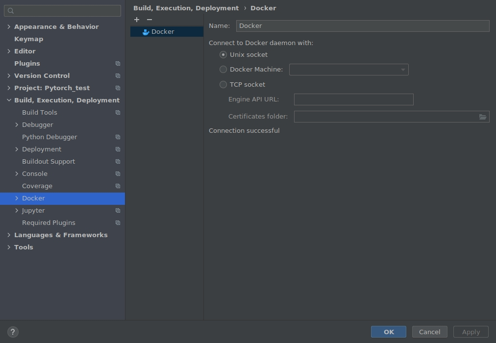
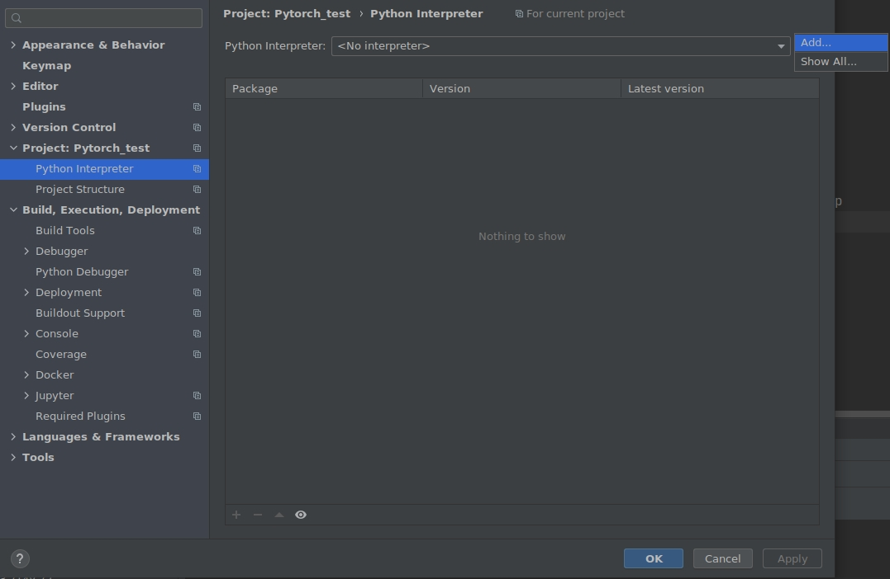
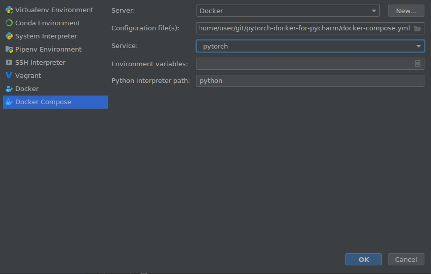

# pytorch-docker-for-pycharm
This is pytorch docker-compose repo for pycharm

----
## Installation

### Installation step 1: Docker

### Installation step 2: nvidia toolkit (for gpu usage)

 `sudo apt-get install -y apt-transport-https ca-certificates curl gnupg-agent software-properties-common`

 `distribution=$(. /etc/os-release;echo $ID$VERSION_ID) && curl -s -L https://nvidia.github.io/nvidia-docker/gpgkey | sudo apt-key add - && curl -s -L https://nvidia.github.io/nvidia-docker/$distribution/nvidia-docker.list | sudo tee /etc/apt/sources.list.d/nvidia-docker.list`

 `sudo apt-get update && sudo apt-get install -y nvidia-container-runtime`

 `sudo nano /etc/docker/daemon.json`
  
  paste following:
  
  `{
    "default-runtime": "nvidia",
    "runtimes": {
        "nvidia": {
            "path": "/usr/bin/nvidia-container-runtime",
            "runtimeArgs": []
     }
    }
  }`
    
    step3: restart docker daemon
    
    `$ sudo systemctl restart docker.service`
    
    step4: check runtime info
    
    `$ docker info | grep Runtime`

----

## step 0 (optional): edit **Dockerfile**
If you want to use a different version or library, you can edit the docker file.

## step 1: build docker container

```
docker build -t pytorch-for-pycharm .
```

## modifiy docker compose file


## pycharm setting 
### docker setting
- open pycharm
- move Preference > Build, Execution, Deploy



### Python Interpreter setting
- add new interpreter



- configure docker-compose

